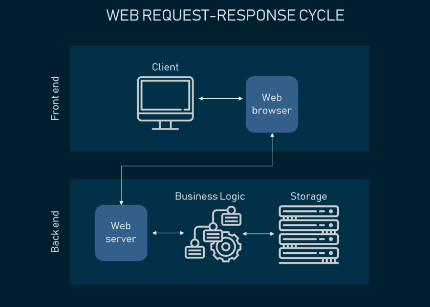

# 📊 Data Analysis Platform - Backend

This is the backend service 

---

## 🧩 Architecture Diagram from link 


---
## 🧩 Architecture Diagram from files



---

## 📚 API Documentation

The backend exposes a REST API for the frontend .

| Endpoint | Method | Description |
|----------|--------|-------------|
| `/api/questions` | `GET` | list of all questions |
| `/api/questions/:id` | `GET` | Get details of a specific question |


> 📌 More detailed API documentation with request/response examples will be added soon.

---

## 🗃️ Database Schema

The backend uses a relational database to store structured data related to users, challenges, and submissions.

**Key Tables:**
- `users`: Stores user account information
- `questions`: Holds question metadata and configs
- `submissions`: User submissions linked to questions
- `evaluations`: Result of executed code submissions


---

## 🛠️ Tech Stack Overview

| Layer | Technology |
|-------|------------|
| **Runtime** | Node.js |
| **Framework** | Express.js |

---

## 🧭 Codebase Overview

| Folder | Description |
|--------|-------------|
| `/controllers` | Business logic for each API route |
| `/routes` | Express route definitions |


---

## ✅ To-Do

- [ ] Document the entire Backend and frontend workflow
- [ ] Document the guide for a new admin/instructor.

---

## 🧩 Architecture Diagram

```mermaid
graph TD
    subgraph Frontend
        A[Web Client / UI]
    end

    subgraph API Layer
        B[Express.js Server]
        B --> C[Controllers]
        B --> D[Middlewares]
    end

    subgraph Background Jobs
        E[Agenda Job Scheduler]
        E --> F[Evaluation Workers]
    end

    subgraph Database
        G[(PostgreSQL)]
    end

    A --> B
    C --> G
    F --> G
    B --> E


